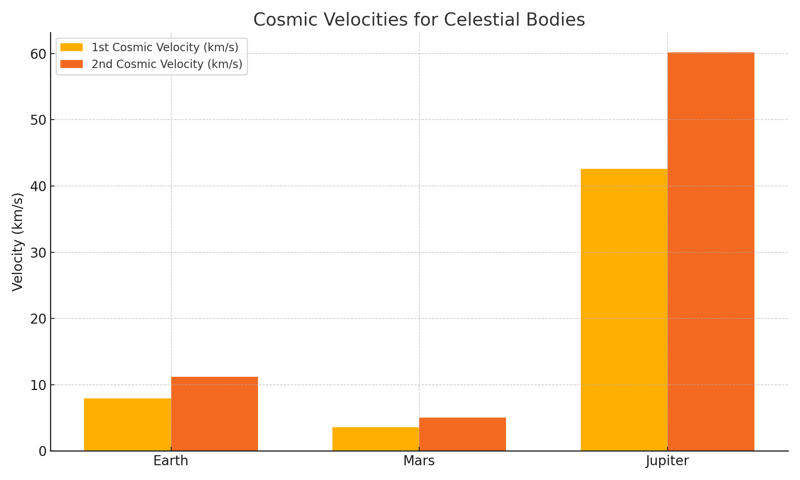

# 🚀 Problem 2: Escape Velocities and Cosmic Velocities

## 🎯 Motivation

The concept of **escape velocity** is crucial for understanding the conditions required to leave a celestial body's gravitational influence. Extending this idea, the **first, second, and third cosmic velocities** define thresholds for orbiting, escaping, and leaving a star system.

These principles underpin modern space exploration — from launching satellites to interplanetary missions and beyond.

---

## 🌍 Definitions of Cosmic Velocities

1. **First Cosmic Velocity**: Minimum speed to stay in a circular orbit near the surface of a planet.  
   $$

   v_1 = \sqrt{\frac{GM}{R}}

   $$

2. **Second Cosmic Velocity (Escape Velocity)**: Minimum speed to escape a planet’s gravity without further propulsion.  
   $$

   v_2 = \sqrt{2} \cdot v_1 = \sqrt{\frac{2GM}{R}}
   
   $$

3. **Third Cosmic Velocity**: Minimum speed to escape the gravity of the Solar System, starting from Earth’s orbit.  
   $$
   v_3 = \text{requires system-level energy balance, approximated with orbital mechanics}
   $$

---

## 📐 Mathematical Derivation

Using energy conservation:  
Kinetic energy:  
$$

E_k = \frac{1}{2}mv^2

$$  
Gravitational potential:  

$$

E_p = -\frac{GMm}{R}

$$

Set total energy to zero to find escape velocity:  

$$

\frac{1}{2}mv^2 - \frac{GMm}{R} = 0  
\Rightarrow v = \sqrt{\frac{2GM}{R}}

$$

---

## 🪐 Velocity Calculation for Celestial Bodies

```python
import numpy as np
import matplotlib.pyplot as plt

# Gravitational constant
G = 6.67430e-11  # m^3 kg^-1 s^-2

# Data: Planet name, mass (kg), radius (m)
bodies = {
    "Earth":   {"mass": 5.972e24, "radius": 6.371e6},
    "Mars":    {"mass": 6.417e23, "radius": 3.3895e6},
    "Jupiter": {"mass": 1.898e27, "radius": 6.9911e7}
}

# Calculate velocities
results = {}
for name, data in bodies.items():
    M, R = data["mass"], data["radius"]
    v1 = np.sqrt(G * M / R)
    v2 = np.sqrt(2 * G * M / R)
    results[name] = {"v1": v1, "v2": v2}

# Bar plot
labels = list(results.keys())
v1_values = [results[k]["v1"] / 1000 for k in labels]  # km/s
v2_values = [results[k]["v2"] / 1000 for k in labels]  # km/s

x = np.arange(len(labels))
width = 0.35

plt.figure(figsize=(10, 6))
plt.bar(x - width/2, v1_values, width, label='1st Cosmic Velocity (km/s)')
plt.bar(x + width/2, v2_values, width, label='2nd Cosmic Velocity (km/s)')
plt.ylabel('Velocity (km/s)')
plt.title('Cosmic Velocities for Planets')
plt.xticks(x, labels)
plt.legend()
plt.grid(True)
plt.tight_layout()
plt.show()

## 📊 Graphical Results



---

## 🚀 Importance in Space Exploration

- **1st Cosmic Velocity**: Used to launch satellites into orbit (e.g. ISS).
- **2nd Cosmic Velocity**: Needed for missions leaving Earth (e.g. Moon, Mars rovers).
- **3rd Cosmic Velocity**: Considered for future interstellar probes.

---

## ✅ Conclusion

Understanding cosmic velocities is fundamental for orbital mechanics and mission planning. From satellites to deep-space exploration, these concepts enable us to calculate the energy and propulsion needed to explore the cosmos.
